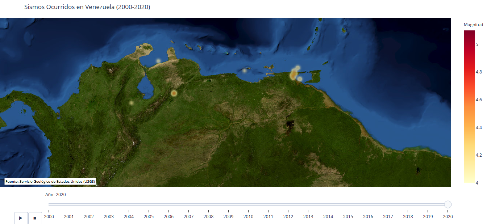

# Sismos-Venezuela
Sismos ocurridos en Venezuela en los últimos 20 años.

Se presenta un mapa creado con [plotly](https://plotly.com/python/mapbox-density-heatmaps/), donde se visualizan los sismos ocurridos en Venezuela en el periodo (30/07/2000-02/08/2020).

La fuente de información proviene del [Servicio Geológico de Estados Unidos (USGS)](https://earthquake.usgs.gov/earthquakes/map/?extent=-86.85607,40.78125&extent=86.81727,360&range=week&magnitude=all&listOnlyShown=true&baseLayer=satellite&settings=true)
